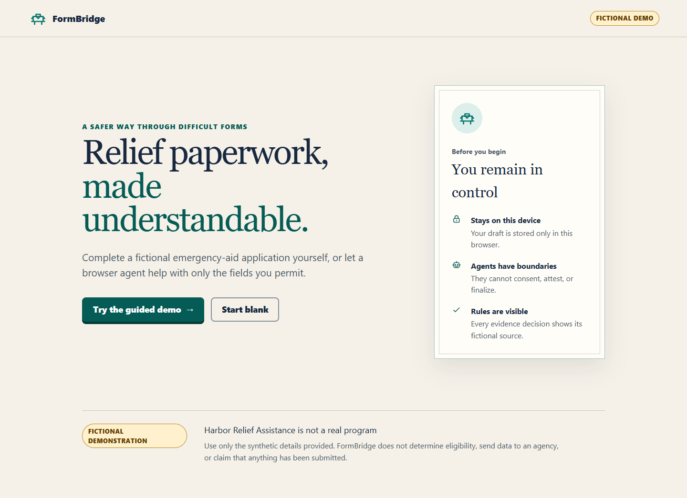

# FormBridge

FormBridge is a privacy-first, accessible demonstration of people and browser agents completing a consequential form together. The included **Harbor Relief Assistance** program is entirely fictional and uses synthetic data.

**Live demo:** [formbridge-webmcp.vercel.app](https://formbridge-webmcp.vercel.app)



## Why WebMCP

The page exposes a small set of structured tools to compatible browser agents. Manual UI actions and agent actions share the same deterministic command engine, validation, revision checks, permissions, persistence, and audit trail. Agents can help prepare an application; they cannot attest, finalize, submit, delete local data, or upload files.

## Local development

Requires Node.js 22.12 or newer.

```bash
npm install
npm run dev
```

Run the full local release gate:

```bash
npm run check
npm run test:e2e
npm run test:a11y
```

## Privacy and safety boundary

- Do not enter real personal information. This public build is a fictional demonstration.
- Drafts stay in IndexedDB in the current browser.
- There is no account, backend, analytics, model API, or government submission.
- “Packet prepared locally” means only that the local review packet is ready to print.

See `docs/ARCHITECTURE.md`, `docs/SECURITY.md`, and `docs/ACCESSIBILITY.md` for implementation and verification details.

## Guided demonstration

1. Choose **Try the guided demo**.
2. Ask a WebMCP-capable browser agent to use the visible synthetic Jordan Lee profile.
3. Observe that `consent_to_contact` remains human-only.
4. Ask the agent to list missing items and evidence options.
5. Map the shelter letter to proof of occupancy as an accepted alternative.
6. Review every answer yourself, check the human attestation, type `JL`, and prepare the packet.
7. Confirm the result says **Packet prepared locally** and never claims submission.

The app remains fully usable in browsers without WebMCP. See [the demo runbook](docs/DEMO.md) for tool-call examples.

## Project map

- `src/domain`: trusted form definition, safe conditional rules, validation, commands, permissions, revisions, idempotency, undo, and audit metadata.
- `src/application`: the one command service shared by humans and agents.
- `src/persistence`: strict Zod parsing and Dexie-backed local storage/quarantine.
- `src/webmcp`: direct feature-detected WebMCP registration and nine least-privilege tools.
- `src/ui`: semantic standard/plain experiences, evidence resolution, review, attestation, and print.
- `tests/e2e`: desktop/mobile golden paths and axe checks.

## Current delivery boundary

The public repository and Vercel production build are live. The complete guided path and all nine WebMCP tools were verified in ChatGPT's in-app browser on September 1, 2026. Manual NVDA/Narrator smoke testing, hackathon registration, and Devpost submission remain release gates and are intentionally not claimed as complete here.
