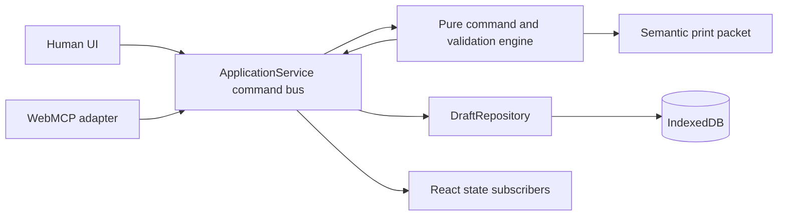

# FormBridge architecture

FormBridge is a static React application with no application backend. The browser stores one synthetic draft in IndexedDB. A future remote repository can implement the same `DraftRepository` interface without changing the domain or UI.

## Invariants

- UI and WebMCP tools never mutate the draft directly.
- Every mutation carries an actor, request ID, and expected revision.
- The pure engine enforces field policies, active conditions, value shape, evidence compatibility, readiness, and attestation ownership.
- Duplicate request IDs replay the original result. Stale revisions fail closed.
- Audit events contain action metadata and entity IDs, never duplicated answer values.
- Agent undo history is bounded to 20 entries; request replay history is bounded to 50.
- Persistence records are strictly parsed before use. Invalid records are quarantined and removed from the active store.

## Main interfaces

- `FormDefinition`: reusable sections, fields, help, conditional rules, policies, and evidence rules.
- `ApplicationWorkspace`: draft plus audit, undo, and idempotency state.
- `applyCommand`: pure mutation seam used by every actor.
- `DraftRepository`: `load`, `save`, `clear`, and `hasDraft`.
- `registerFormBridgeTools`: feature-detected direct WebMCP adapter.

The only supported rule operations are `equals`, `includes`, `exists`, `and`, `or`, and `not`; there is no arbitrary expression execution.

